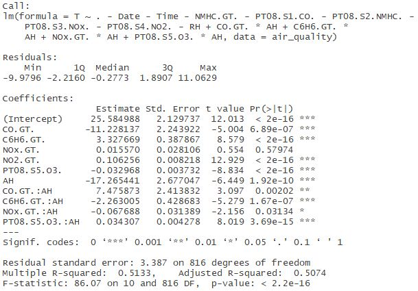

## Exploratory Regression Analysis with R
I acquired a data set about air quality from the UCI Machine Learning Repository to perform some simple regression using R. The data set is about different hourly air quality measures in an Italian city spanning over almost an entire year, that measured amounts of different trace particulates present in the air in a polluted area. The different materials include carbon monoxide(CO), Non-Metanic Hydrocarbons (NMHC), Benzene (C6H6), Total Nitrogen Oxides (NOx) and Nitrogen Dioxide (NO2). The dataset also tracks measurements of Temperature (T), and Absolulte and Relative Humidities (AH and RH, respectively). Find out more about the data set [here](https://archive.ics.uci.edu/ml/datasets/Air+Quality).

### Goal
My aim was to find a model that used as few predictors as possible to predict the temperature using the other variables in the data set, by exploring any significant statistical correlations between the local temperature and the other substances, as well as any significance in the relation between the humidity and chemicals.

### Method
#### Pre-Processing
The first step was to clean up the data so it becomes easy to use in R. Since the data came from European researchers, instead of periods as decimal points they used commas, and as a result the researchers separated the data columns by semicolons. To fix this I simply opened the file in another program and replaced every comma with a period, then every semicolon with a comma, so it could be easily read as a .csv file by R. I loaded the data into R, then cleaned up the missing values in the file. These missing values were marked with '-200' in the columns which were missing a value for that row. I just removed any rows that had a -200 in any of its columns, leaving a total of 827 records to perform regression on.

#### Analyzing the Variables
According to the authors five sensors recorded the Ground True concentrations of carbon monoxide (CO), Non-metanic hydrocarbons (NMHC), Benzene (C6H6), nitrogen oxides (NOx), and nitrogen dioxide (NO2). Additionally, these five sensors also recorded measurements of one additional particulate; as a result, I wanted to consider the relation between the primary and secondary particulate that was measured by each sensor. 

Sensor 1, which targeted CO also recorded measurements of tin oxide, SnO2. The column in the data is labelled PT08.S1. When we plot CO against SnO2, we find that there is a highly linear relationship between them, since they have a correlation coefficient of about 0.94. This implies that knowing one can predict the other, and having both as predictors for the temperature is unneccesary.

Similarly, sensor 2 primarily took measurements of NMHC but also of a material the researchers refer to as titania, which is just titanium dioxide TiO2. The relation between NMHC and TiO2 seemed to be exponential, which I confirmed by plotting log(NMHC) against TiO2, which gave a correlation of about 0.93. Once again, since the secondary chemical TiO2 is highly related to the primary chemical NMHC, I only consider NMHC.

Sensor 3 took measurements primarily of the total nitrogen oxides NOx, but also of tungsten oxide WO3. Like NMHC, there was an exponential relationship between NOx and WO3, which I saw by plotting log(NOx) against WO3 which gave a correlation coeff. of about -0.90. Thus, I only consider NOx for the regression.

Sensor 4 primarily recorded NO2, but also secondarily recorded tungsten oxide as well. I found that the correlation was very linear, with a correlation coeff. of about 0.81. I did not see an exponential relationship between the two, so I did not take log(NO2). I decided to only use NO2 as a predictor.

Lastly, sensor 5 recorded measurements of indium oxide In2O3, but it nominally targets ozone, O3. But since the data does not contain a column for O3, I did not need to consider its relation to indium oxide.

Thus, I did not consider the secondary particulates when forming the model for the Temperature, since the primary particulate would be sufficient, and I wanted to avoid any cross-effects. Similarly, I also wanted to examine the relationship between relative humidity (RH) and absolute humidity (AH). I found that they are weakly linearly correlated, with a coefficient of about 0.48, so I wanted to exclude RH from the regression model, since there would be a weak cross-effect between RH and AH.

I first tried a linear regression model in which every primary particulate along with the Absolute Humidity were used as predictors, and sought to keep only the ones that were statistically significant. When looking at the calculated p-value of a chemical, I considered p-values less than 0.05 to be significant. I found that NMHC had a p-value of about 0.92, so after removing it, I came up with a model that has the 6 explanatory variables CO, C6H6, NOx, NO2, In2O3 and AH. This model served as a fairly accurate predictor of the average temperature, as shown below:

However, I also wanted to examine the cross effects between these particulates and the Absolute Humidity, AH. I added in the term for each variable from the model mulitiplied with the AH. Once again, I examined the significance level and determined that the term for NO2 * AH was not significant since the p-value was about 0.73. After removing that term from the regression I get the model

Note that even though the inclusion of the term NOx * AH makes the term for NOx no longer signifcant, I am still including it in the model. Finally, we get a model for predicting the temperature given the conditions of a subset of the chemicals present in the air, and their interactions with the absolute humidity. Using the model, I make a prediction for the temperature, and compare it with the actual value to determine the percent error.
