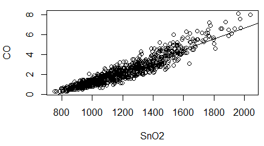
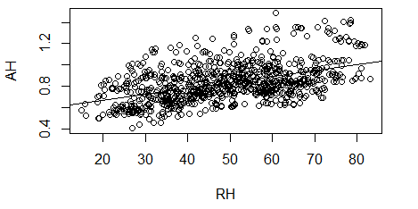
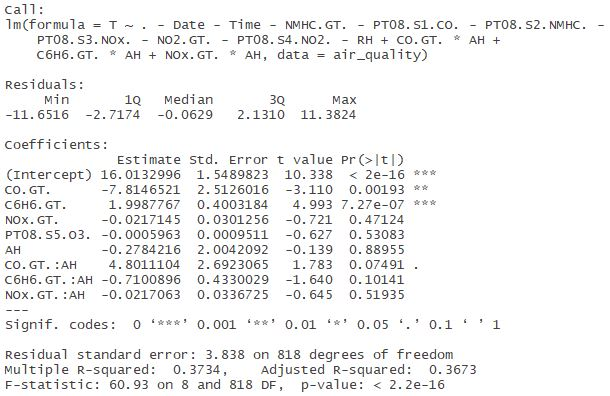

## Exploratory Regression Analysis with R
I acquired a data set about air quality from the UCI Machine Learning Repository to perform some simple regression using R. The data set is about different hourly air quality measures in an Italian city spanning over almost an entire year, that measured amounts of different trace particulates present in the air in a polluted area. The different materials include carbon monoxide(CO), Non-Metanic Hydrocarbons (NMHC), Benzene (C6H6), Total Nitrogen Oxides (NOx) and Nitrogen Dioxide (NO2). The dataset also tracks measurements of Temperature (T), and Absolulte and Relative Humidities (AH and RH, respectively). The concentration of these chemicals is given as micrograms per cubic meter (ug/m^3). Find out more about the data set [here](https://archive.ics.uci.edu/ml/datasets/Air+Quality).

### Goal
My aim was to find a model that used as few predictors as possible to predict the temperature using the other variables in the data set, by exploring any significant statistical correlations between the local temperature and the other substances, as well as any significance in the relation between the humidity and chemicals.

### Method
#### Pre-Processing
The first step was to clean up the data so it becomes easy to use in R. Since the data came from European researchers, instead of periods as decimal points they used commas, and as a result the researchers separated the data columns by semicolons. To fix this I simply opened the file in another program and replaced every comma with a period, then every semicolon with a comma, so it could be easily read as a .csv file by R. I loaded the data into R, then cleaned up the missing values in the file. These missing values were marked with '-200' in the columns which were missing a value for that row. I just removed any rows that had a -200 in any of its columns, leaving a total of 827 records to perform regression on.

#### Analyzing the Variables
According to the authors five sensors recorded the Ground True concentrations of carbon monoxide (CO), Non-metanic hydrocarbons (NMHC), Benzene (C6H6), nitrogen oxides (NOx), and nitrogen dioxide (NO2). Additionally, these five sensors also recorded measurements of one additional particulate; as a result, I wanted to consider the relation between the primary and secondary particulate that was measured by each sensor. 

Sensor 1, which targeted CO also recorded measurements of tin oxide, SnO2. The column in the data is labelled PT08.S1. When we plot CO against SnO2, we find that there is a highly linear relationship between them, since they have a correlation coefficient of about 0.94. This implies that knowing one can predict the other, and having both as predictors for the temperature is unneccesary.

Similarly, sensor 2 primarily took measurements of NMHC but also of a material the researchers refer to as titania, which is just titanium dioxide TiO2. The relation between NMHC and TiO2 seemed to be exponential, which I confirmed by plotting log(NMHC) against TiO2, which gave a correlation of about 0.93. Once again, since the secondary chemical TiO2 is highly related to the primary chemical NMHC, I only consider NMHC.

Sensor 3 took measurements primarily of the total nitrogen oxides NOx, but also of tungsten oxide WO3. Like NMHC, there was an exponential relationship between NOx and WO3, which I saw by plotting log(NOx) against WO3 which gave a correlation coeff. of about -0.90. Thus, I only consider NOx for the regression.

Sensor 4 primarily recorded NO2, but also secondarily recorded tungsten oxide as well. I found that the correlation was very linear, with a correlation coeff. of about 0.81. I did not see an exponential relationship between the two, so I did not take log(NO2). I decided to only use NO2 as a predictor.

Lastly, sensor 5 recorded measurements of indium oxide In2O3, but it nominally targets ozone, O3. But since the data does not contain a column for O3, I did not need to consider its relation to indium oxide.

Thus, I did not consider the secondary particulates when forming the model for the Temperature, since the primary particulate would be sufficient, and I wanted to avoid any cross-effects. Another factor to note is that one of the columns of the data records the amounts of nitrogen dioxide, NO2, and another column records the amounts of total nitrogen oxides, NOx; since NO2 is a form of nitrogen oxide, this implies that the two variables may be related. To test this, I plotted them, and found their correlation coefficient to be about 0.86. Since there is a strong linear relationship, I decided to discard NO2 for my analysis, and only consider NOx.

Similarly, I also wanted to examine the relationship between relative humidity (RH) and absolute humidity (AH). I found that they are weakly linearly correlated, with a coefficient of about 0.48, so I wanted to exclude RH from the regression model, since there would be a weak cross-effect between RH and AH.

#### Prediction with Linear Regression
I first tried a linear regression model in which every primary particulate along with the Absolute Humidity were used as predictors, and sought to keep only the ones that were statistically significant. When looking at the calculated p-value of a chemical, I considered p-values less than 0.05 to be significant. I found that NMHC, In2O3 and AH all had p=values greater than, so I removed them in the next iteration. I came up with a model that has the 3 explanatory variables CO, C6H6, NOx. This model seemed to be a fairly accurate predictor of the average temperature, as shown below:

However, I also wanted to examine the cross effects between these particulates and the Absolute Humidity, AH. I added in the term for each variable from the model mulitiplied with the AH, along with AH itself. Once again, I examined the significance level and found that neither the absolute humidity nor any of the cross-terms had any significance in the regression, as shown below, since all their p-values were much greater than 0.05.

I decided to continue using the second version of the regression model, since that serves as the model with the least number of statistically significant predictors. Using this model I wanted to make predictions of the temperature, and calculate the percent error for the true value. Using the coefficients given by the regression, I have the equation

                                                    T = 15.31 - 3.37c + 1.33b - 0.04n

where *T* is the temperature in Celsius, *c* is the amount of carbon monoxide (CO), *b* is the amount of benzene (C6H6), and *n* is the amount of total nitrogen oxides (NO<subx). I wanted to calculate the average percent error the model achieves when estimating the temperature. Using the given data, I calculated the estimate, then the percent difference between the actual value and calculated value. Then I averaged all these values to find that the average percent difference between the actual temperature and estimates is approximately -6.57%. This implies that the model was consistently underestimating the correct temperature. In order to fix this problem, one solution might be to include more explanatory variables; the value of the adjusted R-squared for this model is about 0.37, and interpreting this in context, this means that only about 37% of the variance in the temperature can be explained by the explanatory variables. Since adding more variables will increase the model's effectiveness. 

Going back and looking at my method, I found that including the predictors that I had initially discarded, that is, the secondary chemicals which were measured by 4 of the 5 sensors, I found that including them all and then removing those which were insignificant dramatically improved the model's adjusted R-squared value, to over 95%. This meant that the regression was doing a much better job at fitting the parameters to the temperature. Likewise, when I calculated the average percent error, I found that it decreased drastically to about -0.03%, which is extremely good. In conclusion, I've learned that even though there may be strong relationships or correlations between variables in a data set, ignoring them may prove to be detrimental to a regression model. 

